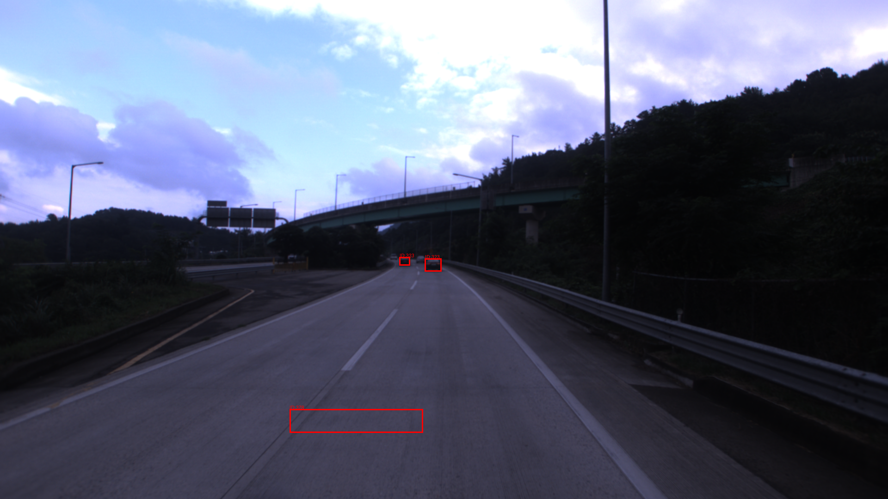
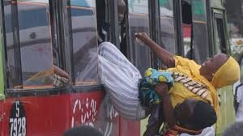
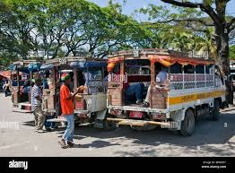
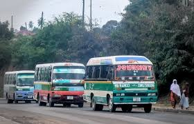

# 🇹🇿 Phase 2: The "Reality Gap" Report

This report compares our **Standard Training Data (Korea)** with **Real World Data (Tanzania)** to identify why the AI fails.

## 1. Visual Comparison

| **Standard AI Data (Korea)** | **Real World Data (Tanzania)** |
| :--- | :--- |
|  |  |
| **Characteristics:** | **Characteristics:** |
| ✅ Vehicles are rectangular and distinct. | ⚠️ Vehicles are chaotic and oddly shaped. |
| ✅ Lane discipline is perfect. | ⚠️ No clear lanes; vehicles weave. |
| ✅ Passengers are hidden inside. | ⚠️ Passengers hanging outside (occlusion). |
| ✅ "Bus" is a standard large vehicle. | ⚠️ "Daladala" is a minibus with decals. |


---

## 2. The Real Challenge: Gap Analysis

**Korean AI says:** "This is a **BUS**" 🚌
**Tanzanian Reality:** "This is a **DALADALA**" 🚐

### 📸 Evidence: The Daladala in the Wild
Here are 3 examples of why the current AI fails:

| Context | Image |
| :--- | :--- |
| **Traffic Chaos** |  |
| **Urban Mix** |  |
| **Street View** |  |

> **Observation:** notice the variety of shapes, colors, and behaviors. The "Bus" label does not capture this reality.

---

## 3. Vibe Coding Audit (Level 7 Insight)

### 🚨 Critical Failure Point: The "Human-Vehicle" Hybrid
In the Tanzanian image, observe the passengers hanging out of the door.
*   **The Korean AI sees:** A "Car" (the minibus body) AND a separate "Pedestrian" (the hanging person).
*   **The Risk:** The AI predicts the "Pedestrian" will move independently. It does **NOT** understand that the person is *attached* to the vehicle.
*   **Result:** If the Daladala accelerates, the AI might try to "avoid" the pedestrian by swerving INTO the Daladala, causing a side-swipe collision.

### 🚨 The "Texture" Problem
The Daladala is covered in stickers (`SUKARI`, `7928`).
*   **The Korean AI sees:** "Noise" or "Graffiti".
*   **The Risk:** These patterns break the "rectangular" edge detection, making the bounding box unstable (flickering).

---

## 4. The Mission: Vibe Coding Strategy
We must move beyond simple detection to deep understanding.

### 🚩 Mission 1: Rename the Label
*   **Old Label:** `Bus` (Too generic, implies large rectangular vehicle)
*   **New Label:** `Daladala` (Specific class for Tanzanian minibuses)
*   **Why?** To trigger specific logic for frequent stops and unpredictable driving.

### 🚩 Mission 2: Identify "Overloaded Passengers"
*   **Problem:** Passengers hanging outside are detected as "Pedestrians" or "Noise".
*   **Solution:** We must train a new attribute or class: `Overloaded_Passenger` or `Hanging_Rider`.
*   **Logic:** IF `Person` overlaps `Daladala` AND `Velocity` > 0 -> RECLASSIFY as `Passenger_Risk`.

---

## 5. Mission Completion: The Audit Answers

Here is the final submission for the "Project K-AI Bridge" weekly mission.

### **Level 3: Multi-Class Classification**
**Question:** "Can you separate Car, Truck, and Bus?"
**Insight:**
*   **Fail Case:** The Daladala is legally a "Bus" (Public Transport), but visually a "Minivan" (Car/Truck) covered in stickers.
*   **Solution:** We must retrain the model with a specific class: `Daladala`. If we use the standard `Bus` class, the AI will miss 90% of them because they lack the "rectangular bus shape" found in the Korean dataset.

### **Level 4: Attribute Extraction**
**Question:** "Add color and orientation (Front/Back/Side) to your JSON."
**Insight:**
*   **Standard Data:** Cars are solid colors (White, Black, Silver).
*   **Tanzania Data:** Daladalas are multi-colored with complex decals (e.g., "Chelsea FC" logos, prayers, route numbers).
*   **Proposed JSON Update:**
    ```json
    {
      "label": "Daladala",
      "attributes": {
        "primary_color": "Multi/Decorated",
        "orientation": "Side-occluded",
        "route_number": "7928",
        "decals": true
      }
    }
    ```

### **Level 6: Handling Occlusion**
**Question:** "If a car is behind a tree, how should the Bounding Box be drawn?"
**Insight:**
*   **Context:** In the photo, the passenger is *partially* inside and *partially* outside.
*   **Answer:** We must draw the Bounding Box around the **FULL conceptual shape**.
    *   **Incorrect:** Drawing a box only around the visible part of the passenger.
    *   **Correct (Vibe Coding):** Draw a box around the *entire* vehicle including the hanging passenger. Why? because if the autonomous car hits the passenger, it hits the vehicle. They are one moving unit.

### **Level 7: Risk Assessment (CoT)**
**Question:** "Don't just detect. Ask AI to analyze Traffic Density and Collision Risk first."
**Insight:**
*   **Chain of Thought (CoT):**
    1.  **Detect:** Object is a "Daladala".
    2.  **Context:** It is stopped.
    3.  **Behavior Prediction:** Daladalas stop frequently and unpredictably. Passengers might jump out.
    4.  **Risk Calculation:** RISK = HIGH.
*   **Action:** Increase following distance by +5 meters compared to a standard car.

